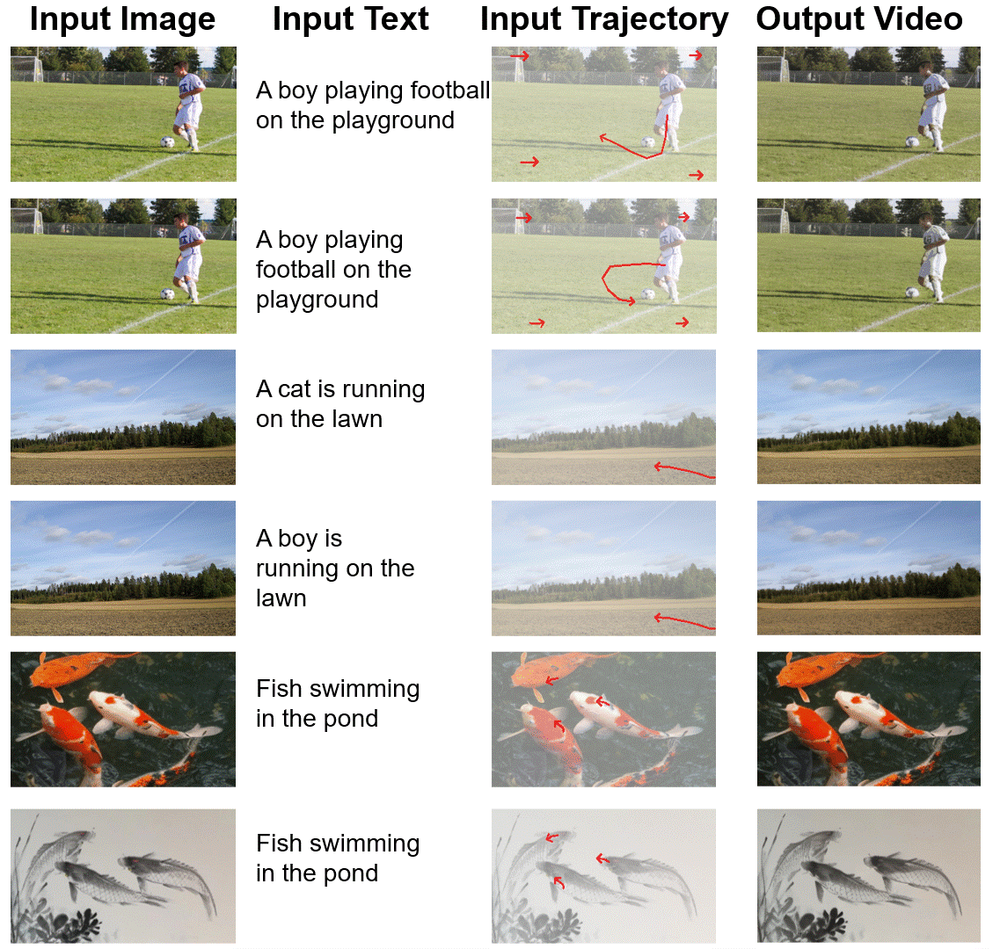

# DragNUWA

**DragNUWA** enables users to manipulate backgrounds or objects within images directly, and the model seamlessly translates these actions into **camera movements** or **object motions**, generating the corresponding video.

See our paper:   [DragNUWA: Fine-grained Control in Video Generation by Integrating Text, Image, and Trajectory](https://arxiv.org/abs/2308.08089)

<a src="https://img.shields.io/badge/%F0%9F%A4%97-Open%20in%20Spaces-blue" href="https://huggingface.co/spaces/yinsming/DragNUWA">
    
</a>
<a src="https://colab.research.google.com/assets/colab-badge.svg" href="TOBEDONE">
    
</a>

### DragNUWA 1.5 (Updated on Jan 8, 2024)

**DragNUWA 1.5** uses Stable Video Diffusion as a backbone to animate an image according to specific path.

Please refer to `assets/DragNUWA1.5/figure_raw` for raw gifs.

<p align="center">  
    
</p>  

<p align="center">  
    
</p>  
<p align="center">  
    
</p>  
<p align="center">  
    
</p>  

### DragNUWA 1.0 (Original Paper)
 [**DragNUWA 1.0**](https://arxiv.org/abs/2308.08089) utilizes text, images, and trajectory as three essential control factors to facilitate highly controllable video generation from semantic, spatial, and temporal aspects.

<p align="center">  
    
</p>  
<p align="center">  
    
</p>  
<p align="center">  
    
</p>

## Getting Start

### Setting Environment 
```Shell
git clone https://github.com/ProjectNUWA/DragNUWA.git
cd DragNUWA

conda create -n DragNUWA python=3.8
conda activate DragNUWA
pip install -r environment.txt
```

### Download Pretrained Weights
Download the [Pretrained Weights](https://drive.google.com/file/d/1Z4JOley0SJCb35kFF4PCc6N6P1ftfX4i/view) to `models/` directory or directly run `bash models/Download.sh`.

### Drag and Animate!
```Shell
python DragNUWA_demo.py
```
It will launch a gradio demo, and you can drag an image and animate it!

### Acknowledgement
We appreciate the open source of the following projects:
[Stable Video Diffusion](https://github.com/Stability-AI/generative-models) &#8194;
[Hugging Face](https://github.com/huggingface) &#8194;
[UniMatch](https://github.com/autonomousvision/unimatch)&#8194;

### Citation
```bibtex
@article{yin2023dragnuwa,
  title={Dragnuwa: Fine-grained control in video generation by integrating text, image, and trajectory},
  author={Yin, Shengming and Wu, Chenfei and Liang, Jian and Shi, Jie and Li, Houqiang and Ming, Gong and Duan, Nan},
  journal={arXiv preprint arXiv:2308.08089},
  year={2023}
}
```

